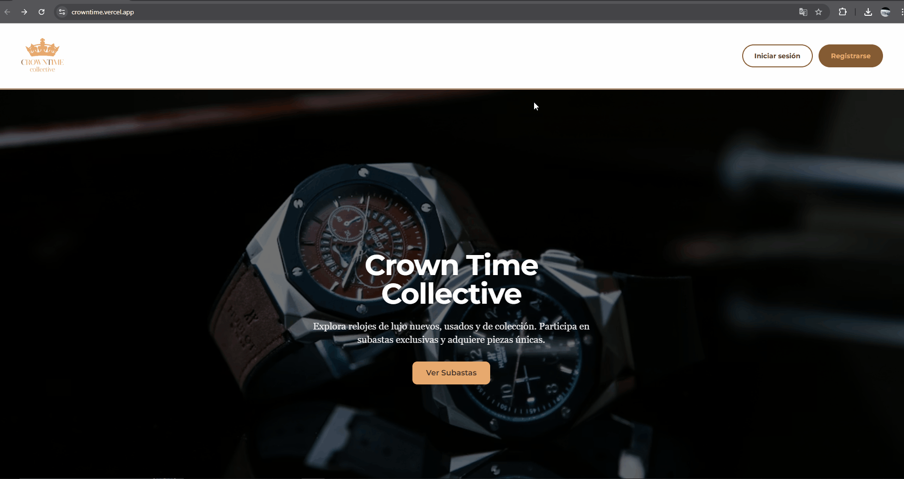
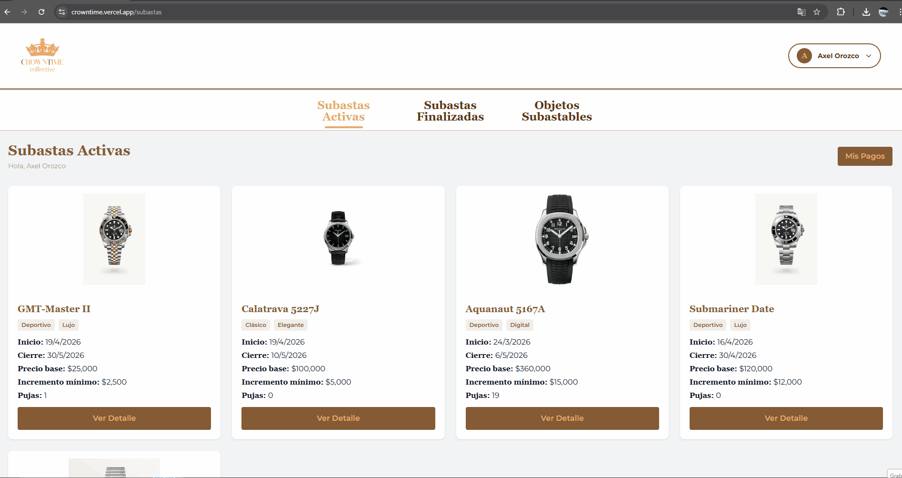
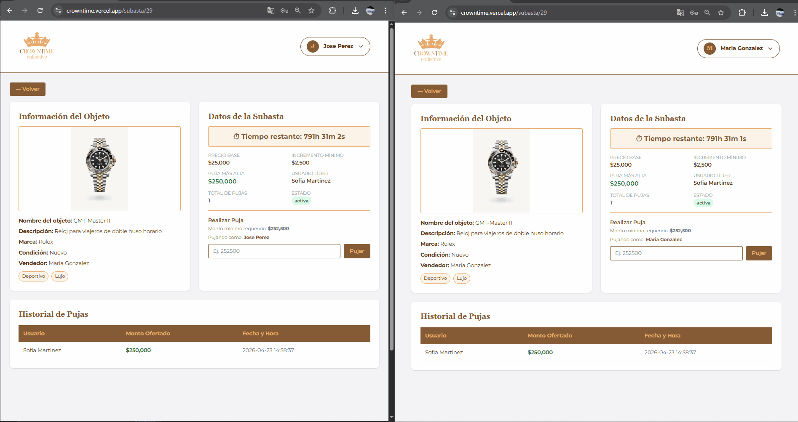

# CrownTime — Real-Time Auction Platform

A full-stack web application for real-time online auctions, where users can register, list items, and place live bids that update instantly across all connected clients.

🔗 **Live Demo:** [crowntime.vercel.app](https://crowntime.vercel.app)

---

## Features

- **User authentication** — Register and log in securely with session management
- **Real-time bidding** — Live bid updates across all active users without page reloads, powered by Pusher WebSockets
- **Auction management** — Create and browse active auctions with item details and current highest bid
- **Data consistency** — Transactional MySQL queries to handle simultaneous bids safely
- **Responsive UI** — Clean, mobile-friendly interface built with Tailwind CSS

---

## Tech Stack

| Layer | Technology |
|-------|-----------|
| Frontend | React, Tailwind CSS, JavaScript (ES6+) |
| Backend | PHP (REST API) |
| Database | MySQL |
| Real-time | Pusher WebSockets |
| Deployment | Vercel (frontend), Railway (backend + database) |
| Version Control | Git, GitHub |

---

## Architecture

```
Auction-Platform/
├── app/        # React frontend (deployed on Vercel)
└── api/        # PHP REST API + MySQL (deployed on Railway)
```

The frontend communicates with the backend via REST API calls. Real-time bid updates are broadcast through Pusher channels, allowing all connected clients to receive live updates without polling.

---

## Getting Started (Local Development)

### Prerequisites
- Node.js 18+
- PHP 8+
- MySQL
- Composer
- Pusher account (free tier works)

### Backend Setup
```bash
cd api
composer install
cp .env.example .env   # Add your DB and Pusher credentials
```

### Frontend Setup
```bash
cd app
npm install
cp .env.example .env   # Add your API URL and Pusher credentials
npm run dev
```

---

## Screenshots

### Register & Login


### Create Auction


### Live Bidding


---

## Author

**Axel Orozco Guzmán**  
[LinkedIn](https://linkedin.com/in/axel-orozco-guzman) · [GitHub](https://github.com/Axel26-prog)